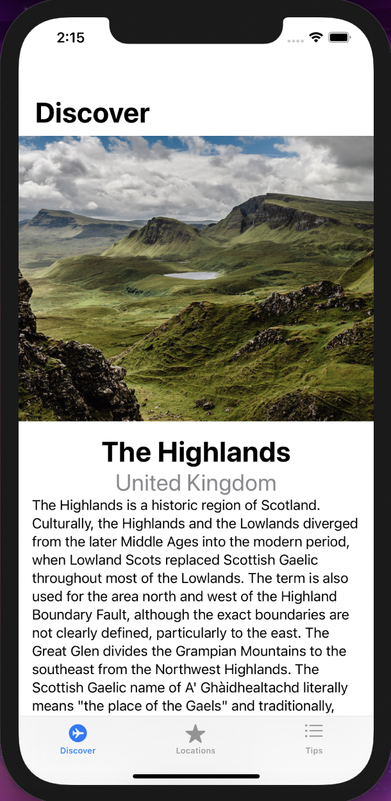
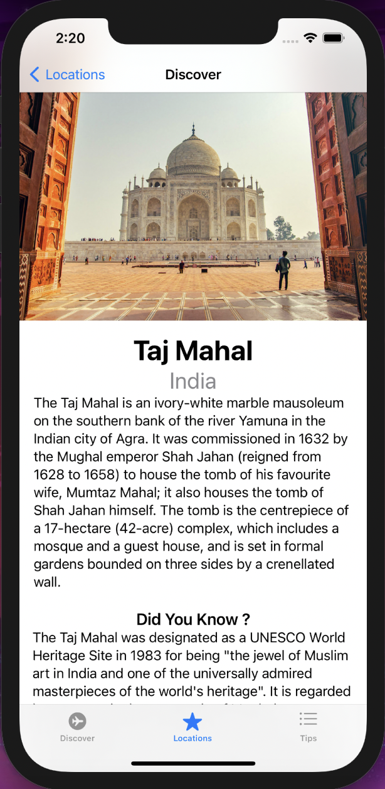
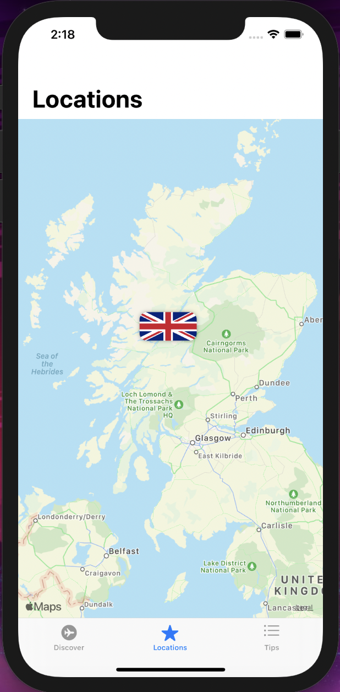
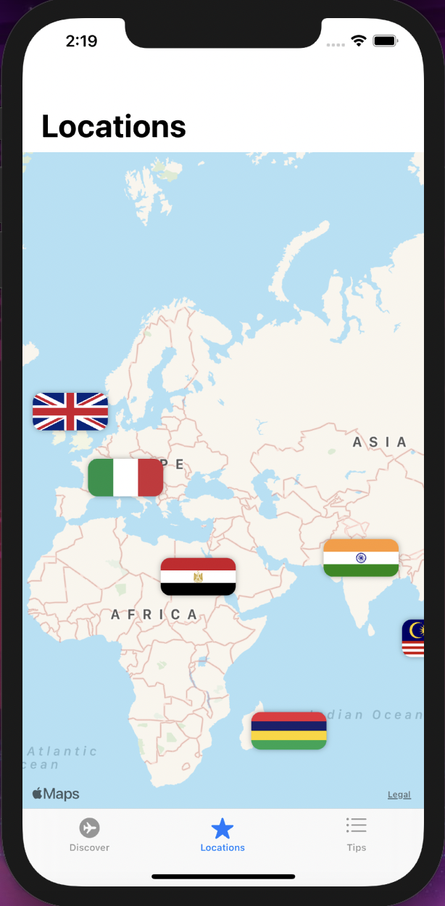
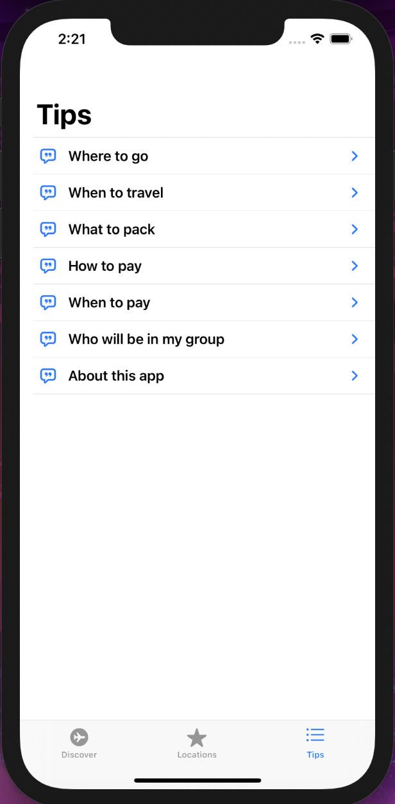
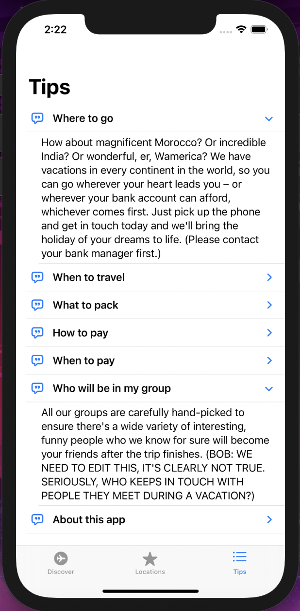

# First iOS App - Tour Guide
A simple interactive application that serves as a tour guide showcasing various tourist locations across the world and detailed description about them, built using `Swift`, `SwiftUI` and `XCode`.

## Tools and Languages Used :
<p>


</p>

## Download and Usage :
The code can be downloaded as a compressed `zip` file from the github web interface.

The repository can also be cloned using:
```
git clone https://github.com/BarathKumarBK-15/Minesweeper.git
```

The code of the app can be compiled using `XCode` and can be run using a simulator or an iOS device

## Components of Project :
- **Swift** files - 3
- **SwiftUI** files - 4
- **JSON** files - 2
- _Note: The above mentioned files are the important additional files added to the default Xcode project files_

## About the Application :
The application is a sample of a real-time tour guide app. It provides detailed information about a few tourist location present in various parts of the world. The application allows us to choose any location/monument among the available ones and provides a brief deascription about its history and features. The various interactive components of the application are explained in detail below.
- **Discover Screen** :
  - It acts as the home page of the app.
  - It provides a simple picture and description about a particular location/monument.
  - The content displayed by this screen changes based upon the choices made by the user in other screens.
  
- **Locations Screen** :
  - The screen basically displays the world map.
  - The various loactions/monuments whose details are avaiable are plotted on it.
  - Clicking on any of these point redirects the user to the `Discover` Screen containing information about it.
  - The screen provides feature to zoom in/out and move through the map by swiping

- **Tips Screen** :
  - It is the _QnA_ screen of the application.
  - It features some frequently asked question and their corresponding answers can be retrieved by clicking on them.
  
- **Graphical Features** :
  - The project contains **multiple graphical content** ranging from _bending of borders_ to _styled fonts_, _contrasting colour switches_, _pictures_ and _eye-soothing layout_.
  - The UI at the same time does not compromise on interactivity.
  - The `Tips` screen and the `Locations` screen provide great graphical interactivity like drop down of answers and navigation through the map respectively.
  
- **Swift and SwiftUI** :
  - The `Swift` and `SwiftUI` play the most significal role, driving the entire application.
  - The entire application is built up on various user defined data structures used to represent various views and store decoded `JSON` files.
  - Various other inbuilt header files and inbuilt views are used to reach higher capabilities.
  
## Screenshots of the Application :

### Discover Screen:
<table>
  <tr>
    <td>  </td>
    <td>  </td>
  </tr>
</table>

### Locations Screen:
<table>
  <tr>
    <td>  </td>
    <td>  </td>
  </tr>
</table>

### Tips Screen:
<table>
  <tr>
    <td>  </td>
    <td>  </td>
  </tr>
</table>
